# Meshtastic Compression Showdown

This project contain benchmarks of various compression algorithms applied on a data of meshtastic packets.

For context a Reciprocal Compression Ratio **above** 1 means the compressed data is **bigger** than the uncompressed data.
One **bellow** 1 means the compressed data is **smaller** than the uncompressed data.

## Results

| Compressor | Average Reciprocal Compression Ratio | Average Reciprocal Compression Ratio (TEXT_MESSAGE_APP only) |
|------------|--------------------------------------|-------------------------------------------------------------|
| `unishox2_meshtastic` | 0.9983 | 0.7637 |
| `noop` | 1.0000 | 1.0000 |
| `flate_klauspost` | 1.0647 | 1.0595 |
| `flate_std` | 1.1275 | 1.1595 |
| `lzw_std` | 1.1478 | 1.1330 |
| `zstd_klauspost` | 1.1792 | 1.2531 |
| `zlib_klauspost` | 1.1868 | 1.2543 |
| `zlib_std` | 1.2497 | 1.3544 |
| `s2_klauspost` | 1.3629 | 1.5730 |
| `snappy_klauspost` | 1.3646 | 1.5775 |
| `gzip_klauspost` | 1.4311 | 1.6440 |
| `gzip_std` | 1.4940 | 1.7440 |
## CDF Graphs

The following graphs show the cumulative distribution function (CDF) of the reciprocal compression ratios for each compressor.

### `unishox2_meshtastic`

### `noop`

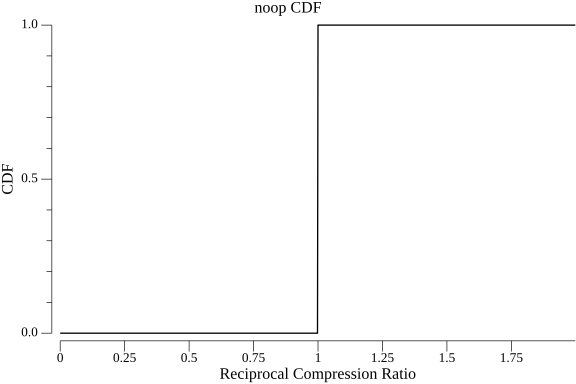

### `flate_klauspost`

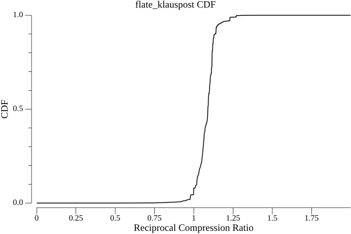

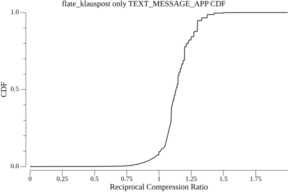

### `flate_std`

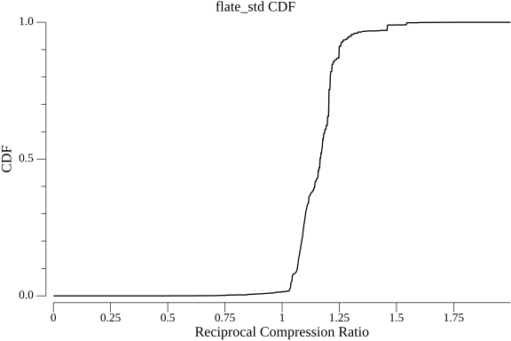

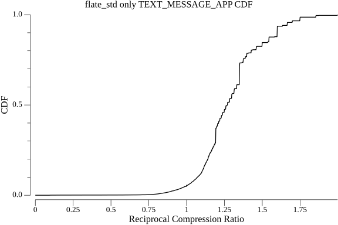

### `lzw_std`

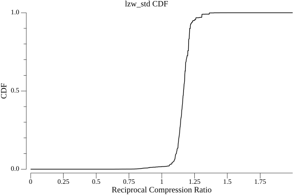

### `zstd_klauspost`

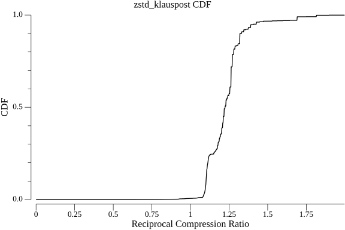

### `zlib_klauspost`

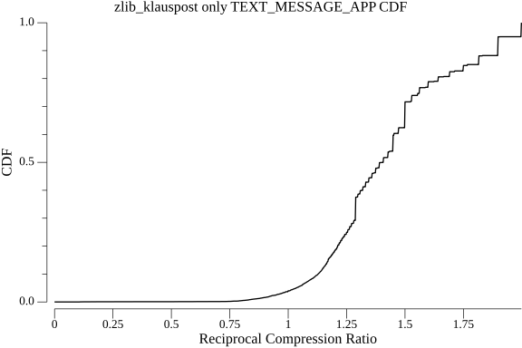

### `zlib_std`

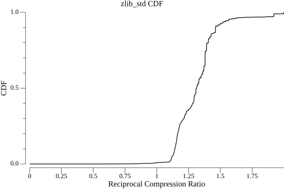

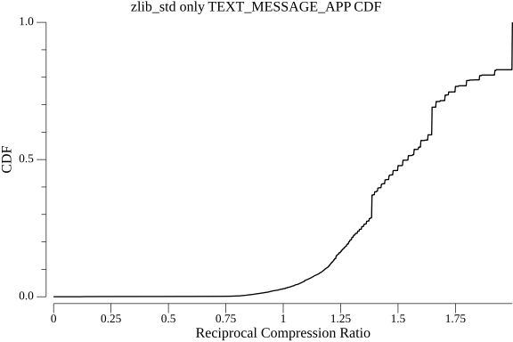

### `s2_klauspost`

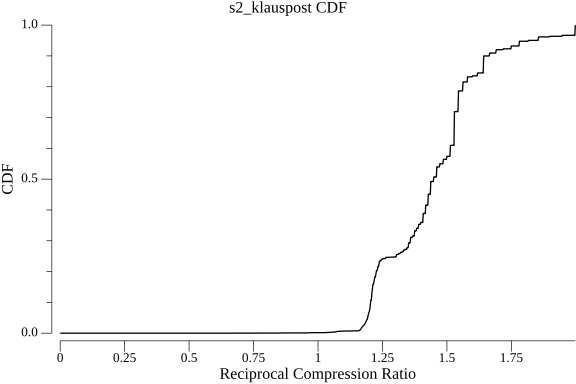

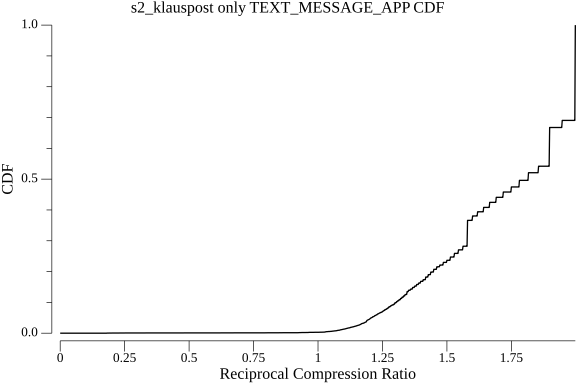

### `snappy_klauspost`

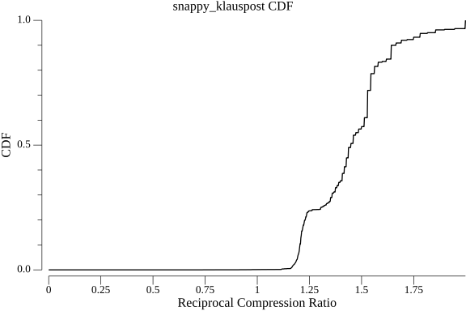

### `gzip_klauspost`

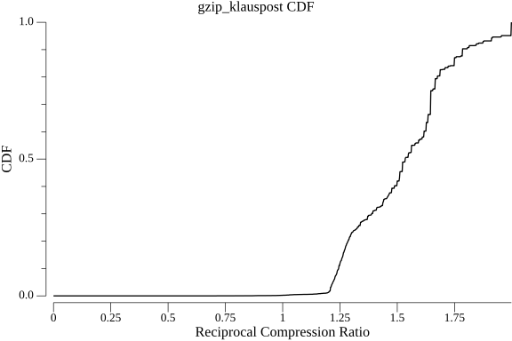

### `gzip_std`

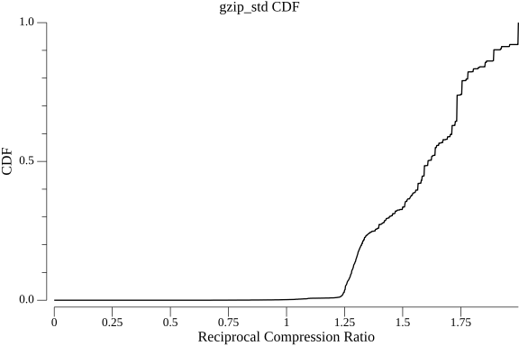

