# Meshtastic Compression Showdown

This project contain benchmarks of various compression algorithms applied on a data of meshtastic packets.

For context a Reciprocal Compression Ratio **above** 1 means the compressed data is **bigger** than the uncompressed data.
One **bellow** 1 means the compressed data is **smaller** than the uncompressed data.

## Results

| Compressor | Average Reciprocal Compression Ratio | Average Reciprocal Compression Ratio (TEXT_MESSAGE_APP only) |
|------------|--------------------------------------|-------------------------------------------------------------|
| `unishox2_meshtastic` | 0.9983 | 0.7578 |
| `shoco_TextEn_proposed_tmthrgd_Jorropo` | 0.9988 | 0.7722 |
| `shoco_TextEn_tmthrgd_Jorropo` | 0.9988 | 0.7825 |
| `smaz_cespare_Jorropo` | 0.9990 | 0.7965 |
| `shoco_WordsEn_proposed_tmthrgd_Jorropo` | 0.9991 | 0.8388 |
| `shoco_WordsEn_tmthrgd_Jorropo` | 0.9992 | 0.8482 |
| `shoco_FilePath_proposed_tmthrgd_Jorropo` | 0.9993 | 0.8661 |
| `shoco_Emails_proposed_tmthrgd_Jorropo` | 0.9994 | 0.8755 |
| `shoco_FilePath_tmthrgd_Jorropo` | 0.9994 | 0.8747 |
| `shoco_Emails_tmthrgd_Jorropo` | 0.9994 | 0.8838 |
| `noop` | 1.0000 | 1.0000 |
| `lz4_cloudflareHC` | 1.0325 | 1.0429 |
| `lz4_cloudflare` | 1.0330 | 1.0434 |
| `flate_klauspost` | 1.0642 | 1.0595 |
| `rle_inkyblackness` | 1.0859 | 1.1225 |
| `flate_std` | 1.1264 | 1.1595 |
| `lzw_std` | 1.1473 | 1.1330 |
| `shoco_TextEn_proposed_tmthrgd` | 1.1715 | 0.8575 |
| `shoco_WordsEn_proposed_tmthrgd` | 1.1736 | 0.9241 |
| `shoco_Emails_proposed_tmthrgd` | 1.1755 | 0.9608 |
| `shoco_FilePath_proposed_tmthrgd` | 1.1758 | 0.9516 |
| `zstd_klauspost` | 1.1776 | 1.2531 |
| `zlib_klauspost` | 1.1852 | 1.2543 |
| `shoco_TextEn_tmthrgd` | 1.2200 | 0.8466 |
| `shoco_WordsEn_tmthrgd` | 1.2220 | 0.9133 |
| `shoco_Emails_tmthrgd` | 1.2240 | 0.9500 |
| `shoco_FilePath_tmthrgd` | 1.2243 | 0.9407 |
| `zlib_std` | 1.2475 | 1.3544 |
| `smaz_cespare` | 1.2514 | 0.8865 |
| `lz4_pierrec` | 1.2995 | 1.4766 |
| `s2_klauspost` | 1.3596 | 1.5730 |
| `snappy_klauspost` | 1.3613 | 1.5775 |
| `gzip_klauspost` | 1.4273 | 1.6440 |
| `gzip_std` | 1.4896 | 1.7440 |
## CDF Graphs

The following graphs show the cumulative distribution function (CDF) of the reciprocal compression ratios for each compressor.

### `unishox2_meshtastic`

### `shoco_TextEn_proposed_tmthrgd_Jorropo`

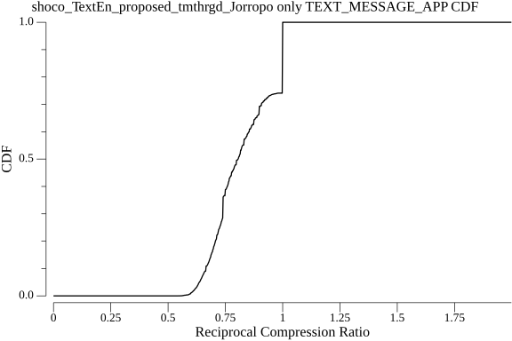

### `shoco_TextEn_tmthrgd_Jorropo`

### `smaz_cespare_Jorropo`

### `shoco_WordsEn_proposed_tmthrgd_Jorropo`

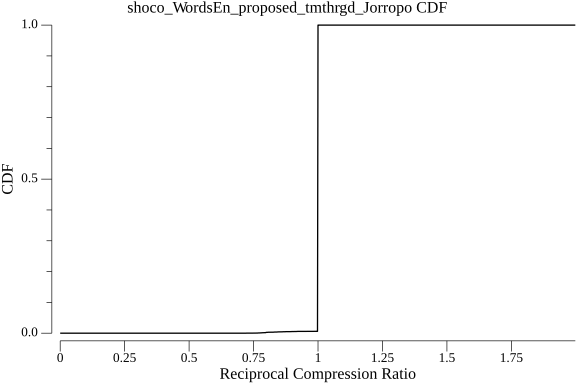

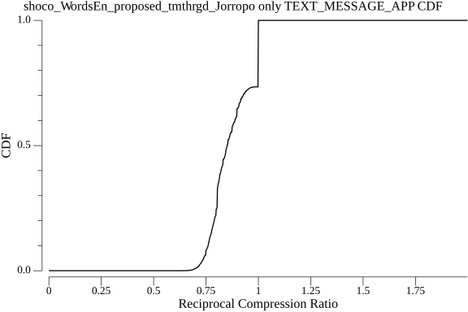

### `shoco_WordsEn_tmthrgd_Jorropo`

### `shoco_FilePath_proposed_tmthrgd_Jorropo`

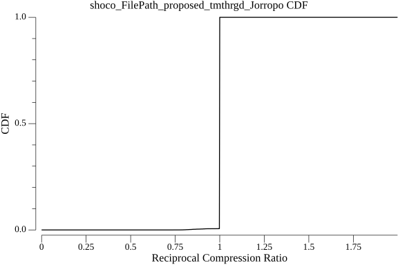

### `shoco_Emails_proposed_tmthrgd_Jorropo`

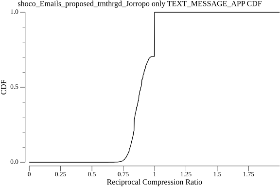

### `shoco_FilePath_tmthrgd_Jorropo`

### `shoco_Emails_tmthrgd_Jorropo`

### `noop`

### `lz4_cloudflareHC`

### `lz4_cloudflare`

### `flate_klauspost`

### `rle_inkyblackness`

### `flate_std`

### `lzw_std`

### `shoco_TextEn_proposed_tmthrgd`

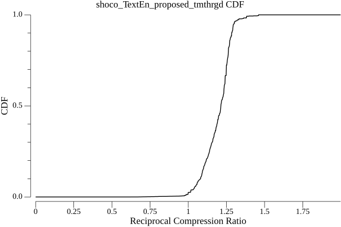

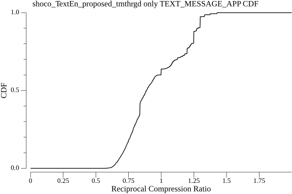

### `shoco_WordsEn_proposed_tmthrgd`

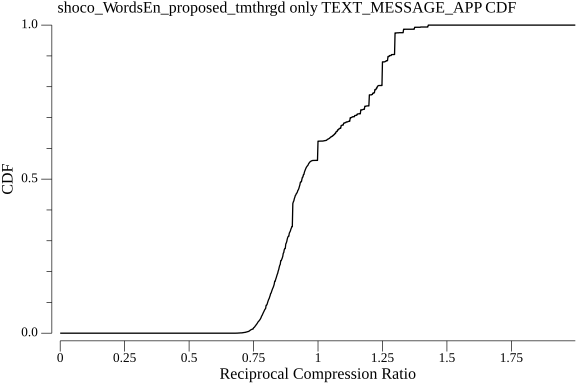

### `shoco_Emails_proposed_tmthrgd`

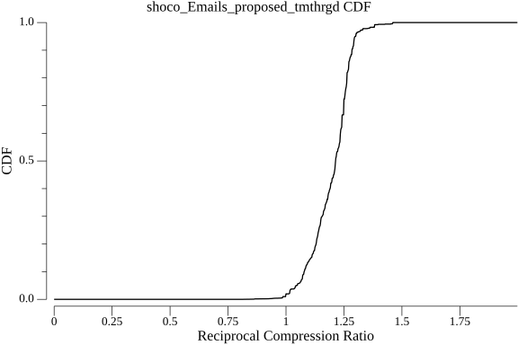

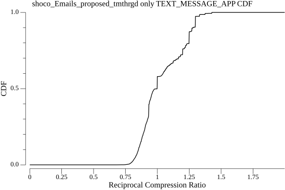

### `shoco_FilePath_proposed_tmthrgd`

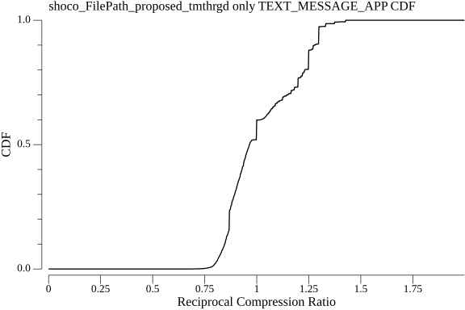

### `zstd_klauspost`

### `zlib_klauspost`

### `shoco_TextEn_tmthrgd`

### `shoco_WordsEn_tmthrgd`

### `shoco_Emails_tmthrgd`

### `shoco_FilePath_tmthrgd`

### `zlib_std`

### `smaz_cespare`

### `lz4_pierrec`

### `s2_klauspost`

### `snappy_klauspost`

### `gzip_klauspost`

### `gzip_std`

