# Meshtastic Compression Showdown

This project contain benchmarks of various compression algorithms applied on a data of meshtastic packets.

For context a Reciprocal Compression Ratio **above** 1 means the compressed data is **bigger** than the uncompressed data.
One **bellow** 1 means the compressed data is **smaller** than the uncompressed data.

## Results

| Compressor | Average Reciprocal Compression Ratio (TEXT_MESSAGE_APP only) |
|------------|--------------------------------------------------------------|
| `unishox2_alpha_only` | 0.6976 |
| `meshtasticmodel_V1_EgonElbre` | 0.7154 |
| `meshtasticmodel_V4_EgonElbre` | 0.7154 |
| `meshtasticmodel_V5_EgonElbre` | 0.7154 |
| `meshtasticmodel_V6_EgonElbre` | 0.7154 |
| `meshtasticmodel_V10_EgonElbre` | 0.7158 |
| `meshtasticmodel_V8_EgonElbre` | 0.7158 |
| `meshtasticmodel_V9_EgonElbre` | 0.7158 |
| `meshtasticmodel_V7_EgonElbre` | 0.7173 |
| `meshtasticmodel_V3_EgonElbre` | 0.7188 |
| `snowflake_Jorropo` | 0.7196 |
| `unishox2_alpha_num_only` | 0.7325 |
| `unishox2_favor_alpha` | 0.7432 |
| `unishox2_no_uni_favor_text` | 0.7432 |
| `unishox2_no_uni` | 0.7515 |
| `unishox2_url` | 0.7519 |
| `unishox2_json_no_uni` | 0.7523 |
| `unishox2_alpha_num_sym_only` | 0.7534 |
| `unishox2_alpha_num_sym_only_text` | 0.7534 |
| `unishox2_default` | 0.7542 |
| `unishox2_xml` | 0.7542 |
| `unishox2_html` | 0.7549 |
| `unishox2_json` | 0.7549 |
| `unishox2_favor_dict` | 0.7568 |
| `shoco_TextEn_tmthrgd_Jorropo` | 0.7606 |
| `unishox2_favor_sym` | 0.7614 |
| `unishox2_favor_umlaut` | 0.7618 |
| `unishox2_no_dict` | 0.7622 |
| `smaz_cespare_Jorropo` | 0.7998 |
| `meshtasticmodel_V2_EgonElbre` | 0.8108 |
| `shoco_WordsEn_tmthrgd_Jorropo` | 0.8351 |
| `shoco_TextEn_tmthrgd` | 0.8419 |
| `shoco_FilePath_tmthrgd_Jorropo` | 0.8678 |
| `shoco_Emails_tmthrgd_Jorropo` | 0.8750 |
| `smaz_cespare` | 0.8807 |
| `shoco_WordsEn_tmthrgd` | 0.9160 |
| `meshtasticmodel_pbmodel-o1_EgonElbre` | 0.9328 |
| `meshtasticmodel_pbmodel-o2_EgonElbre` | 0.9328 |
| `meshtasticmodel_pbmodel-varint-o1_EgonElbre` | 0.9328 |
| `meshtasticmodel_pbmodel-varint-o2_EgonElbre` | 0.9328 |
| `meshtasticmodel_pbmodel-varint_EgonElbre` | 0.9328 |
| `meshtasticmodel_pbmodel_EgonElbre` | 0.9328 |
| `shoco_FilePath_tmthrgd` | 0.9487 |
| `shoco_Emails_tmthrgd` | 0.9559 |
| `noop` | 1.0000 |
| `lz4_cloudflareHC` | 1.0369 |
| `lz4_cloudflare` | 1.0376 |
| `flate_klauspost` | 1.0388 |
| `lzw_std` | 1.1071 |
| `rle_inkyblackness` | 1.1098 |
| `flate_std` | 1.1273 |
| `zlib_klauspost` | 1.2120 |
| `zlib_std` | 1.3005 |
| `lz4_pierrec` | 1.4229 |
| `s2_klauspost` | 1.5068 |
| `snappy_klauspost` | 1.5118 |
| `gzip_klauspost` | 1.5585 |
| `gzip_std` | 1.6470 |

| Compressor | Average Reciprocal Compression Ratio |
|------------|--------------------------------------|
| `snowflake_Jorropo` | 0.7837 |
| `meshtasticmodel_pbmodel-o1_EgonElbre` | 0.9541 |
| `meshtasticmodel_pbmodel-o2_EgonElbre` | 0.9541 |
| `meshtasticmodel_pbmodel_EgonElbre` | 0.9541 |
| `meshtasticmodel_pbmodel-varint-o1_EgonElbre` | 0.9541 |
| `meshtasticmodel_pbmodel-varint-o2_EgonElbre` | 0.9541 |
| `meshtasticmodel_pbmodel-varint_EgonElbre` | 0.9541 |
| `meshtasticmodel_V1_EgonElbre` | 0.9564 |
| `meshtasticmodel_V4_EgonElbre` | 0.9564 |
| `meshtasticmodel_V5_EgonElbre` | 0.9564 |
| `meshtasticmodel_V6_EgonElbre` | 0.9564 |
| `meshtasticmodel_V10_EgonElbre` | 0.9580 |
| `meshtasticmodel_V8_EgonElbre` | 0.9580 |
| `meshtasticmodel_V9_EgonElbre` | 0.9580 |
| `meshtasticmodel_V7_EgonElbre` | 0.9583 |
| `meshtasticmodel_V3_EgonElbre` | 0.9610 |
| `unishox2_alpha_only` | 0.9983 |
| `unishox2_alpha_num_only` | 0.9985 |
| `unishox2_favor_alpha` | 0.9986 |
| `unishox2_no_uni_favor_text` | 0.9986 |
| `unishox2_no_uni` | 0.9986 |
| `unishox2_url` | 0.9986 |
| `unishox2_json_no_uni` | 0.9986 |
| `unishox2_alpha_num_sym_only` | 0.9986 |
| `unishox2_alpha_num_sym_only_text` | 0.9986 |
| `unishox2_default` | 0.9986 |
| `unishox2_xml` | 0.9986 |
| `unishox2_html` | 0.9986 |
| `unishox2_json` | 0.9986 |
| `unishox2_favor_dict` | 0.9986 |
| `shoco_TextEn_tmthrgd_Jorropo` | 0.9987 |
| `unishox2_favor_sym` | 0.9987 |
| `unishox2_favor_umlaut` | 0.9987 |
| `unishox2_no_dict` | 0.9987 |
| `smaz_cespare_Jorropo` | 0.9989 |
| `shoco_WordsEn_tmthrgd_Jorropo` | 0.9991 |
| `shoco_FilePath_tmthrgd_Jorropo` | 0.9993 |
| `shoco_Emails_tmthrgd_Jorropo` | 0.9993 |
| `noop` | 1.0000 |
| `meshtasticmodel_V2_EgonElbre` | 1.0147 |
| `lz4_cloudflareHC` | 1.0340 |
| `lz4_cloudflare` | 1.0344 |
| `flate_klauspost` | 1.0660 |
| `rle_inkyblackness` | 1.0849 |
| `flate_std` | 1.1292 |
| `lzw_std` | 1.1484 |
| `shoco_TextEn_tmthrgd` | 1.1694 |
| `shoco_WordsEn_tmthrgd` | 1.1705 |
| `shoco_Emails_tmthrgd` | 1.1718 |
| `shoco_FilePath_tmthrgd` | 1.1728 |
| `zlib_klauspost` | 1.1903 |
| `smaz_cespare` | 1.2517 |
| `zlib_std` | 1.2535 |
| `lz4_pierrec` | 1.3083 |
| `s2_klauspost` | 1.3701 |
| `snappy_klauspost` | 1.3722 |
| `gzip_klauspost` | 1.4390 |
| `gzip_std` | 1.5022 |

## CDF Graphs

The following graphs show the cumulative distribution function (CDF) of the reciprocal compression ratios for each compressor.

### `snowflake_Jorropo`

### `meshtasticmodel_pbmodel-o1_EgonElbre`

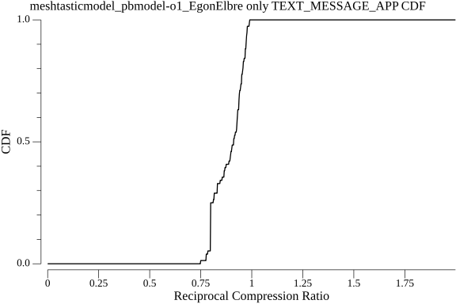

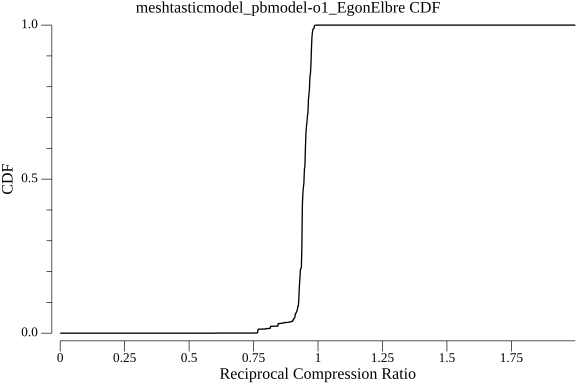

### `meshtasticmodel_pbmodel-o2_EgonElbre`

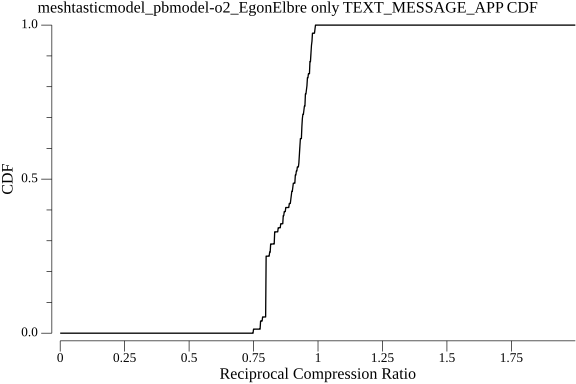

### `meshtasticmodel_pbmodel_EgonElbre`

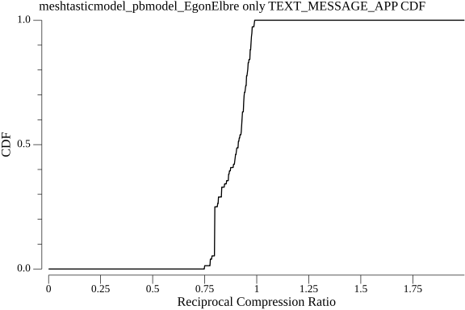

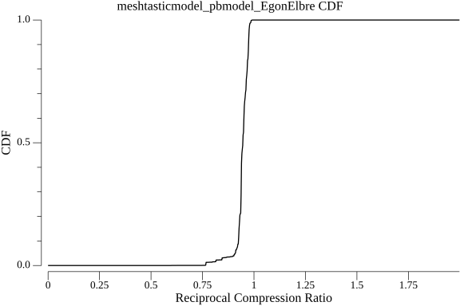

### `meshtasticmodel_pbmodel-varint-o1_EgonElbre`

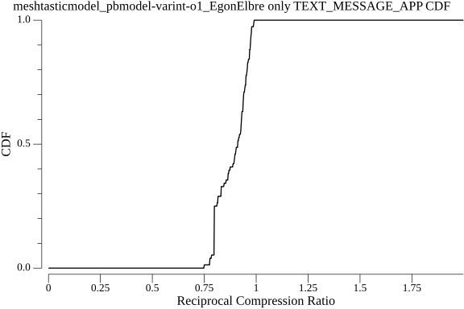

### `meshtasticmodel_pbmodel-varint-o2_EgonElbre`

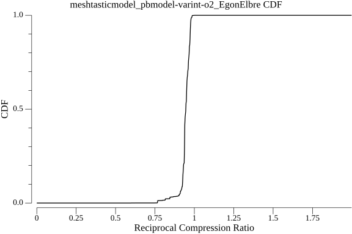

### `meshtasticmodel_pbmodel-varint_EgonElbre`

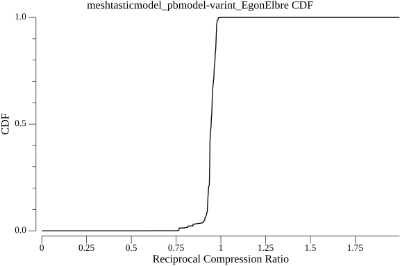

### `meshtasticmodel_V1_EgonElbre`

### `meshtasticmodel_V4_EgonElbre`

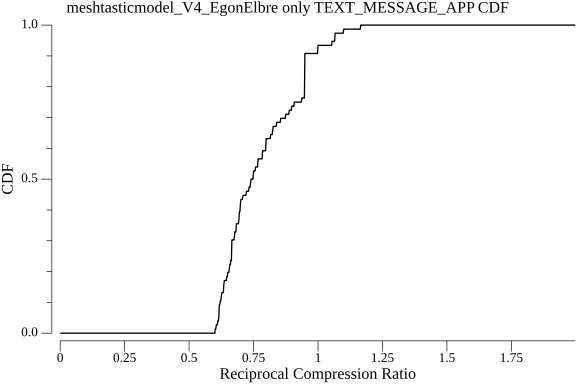

### `meshtasticmodel_V5_EgonElbre`

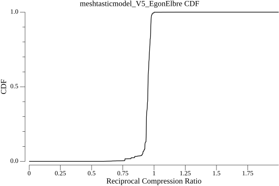

### `meshtasticmodel_V6_EgonElbre`

### `meshtasticmodel_V10_EgonElbre`

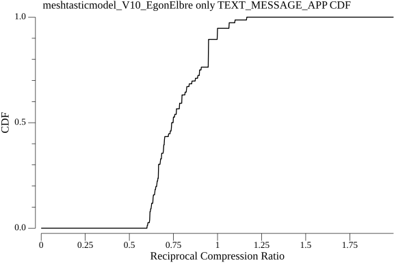

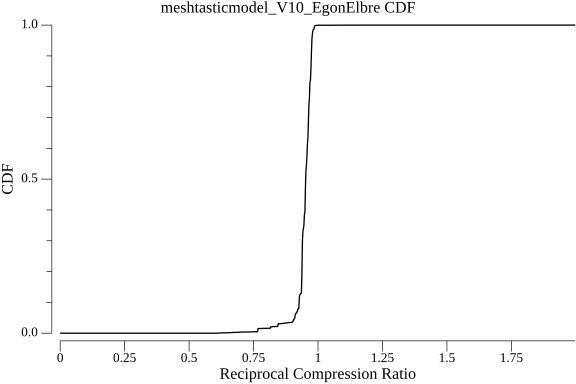

### `meshtasticmodel_V8_EgonElbre`

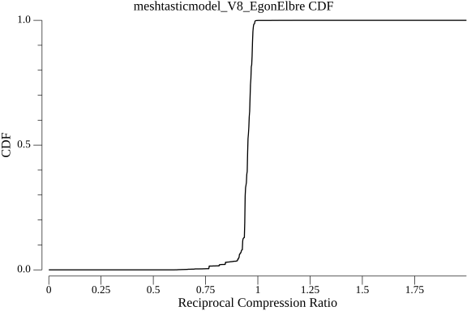

### `meshtasticmodel_V9_EgonElbre`

### `meshtasticmodel_V7_EgonElbre`

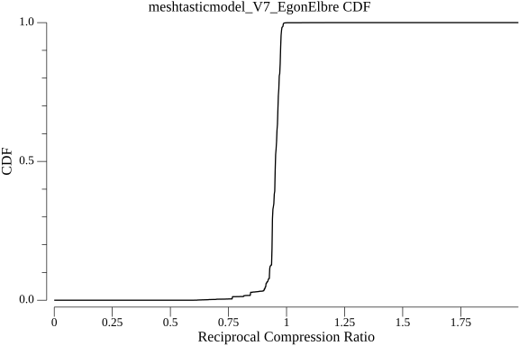

### `meshtasticmodel_V3_EgonElbre`

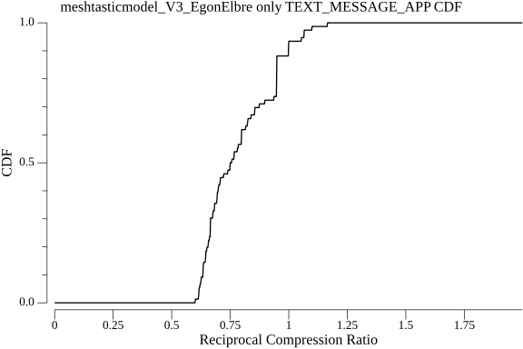

### `unishox2_alpha_only`

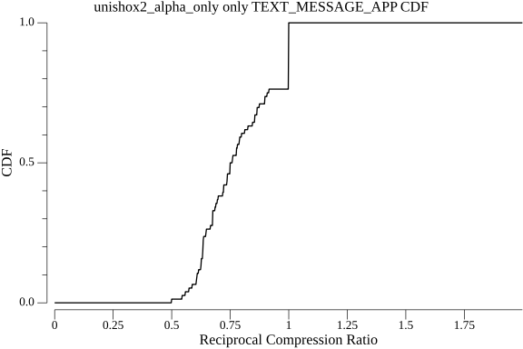

### `unishox2_alpha_num_only`

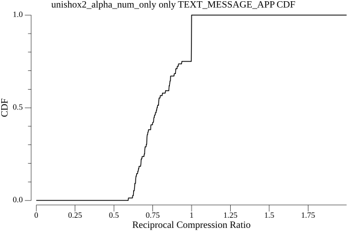

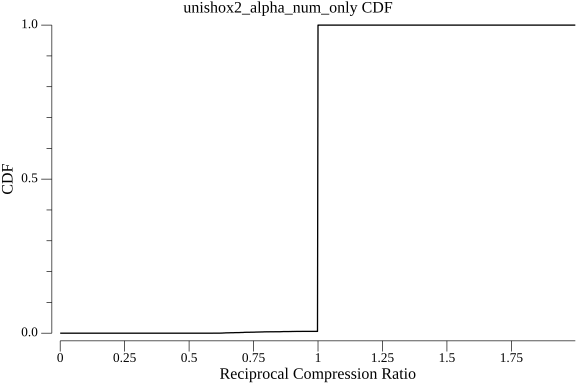

### `unishox2_favor_alpha`

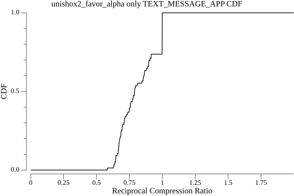

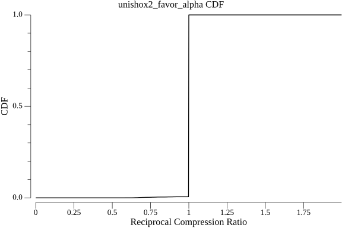

### `unishox2_no_uni_favor_text`

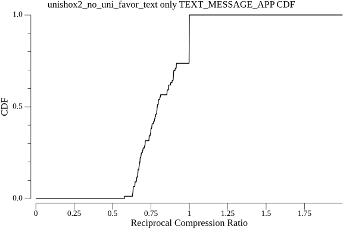

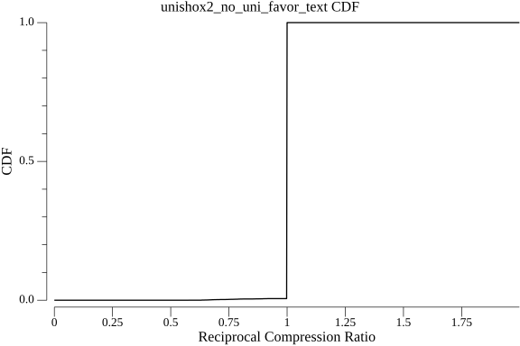

### `unishox2_no_uni`

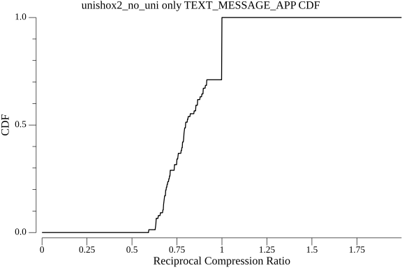

### `unishox2_url`

### `unishox2_json_no_uni`

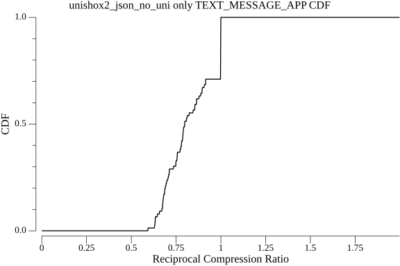

### `unishox2_alpha_num_sym_only`

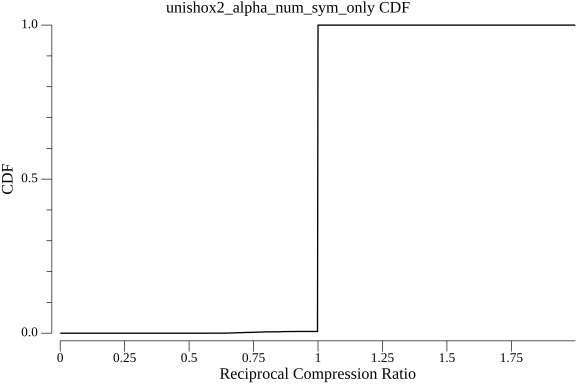

### `unishox2_alpha_num_sym_only_text`

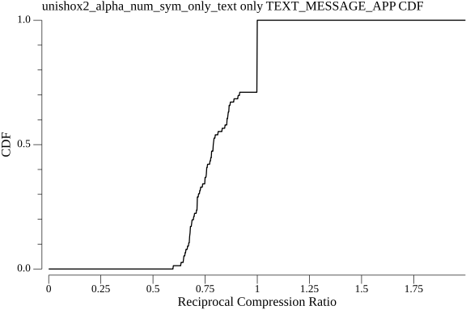

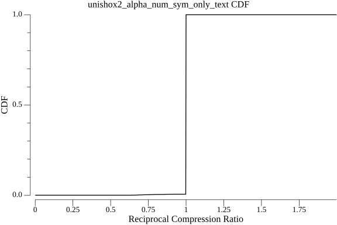

### `unishox2_default`

### `unishox2_xml`

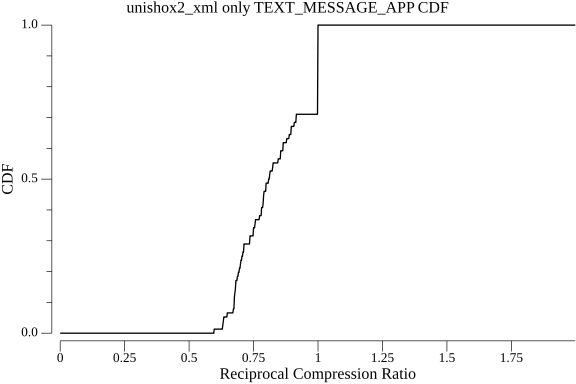

### `unishox2_html`

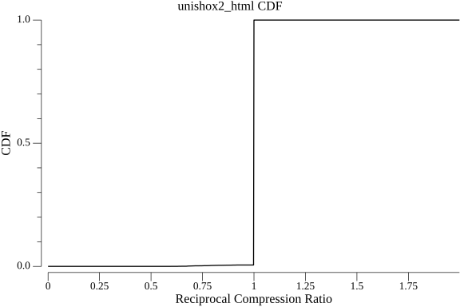

### `unishox2_json`

### `unishox2_favor_dict`

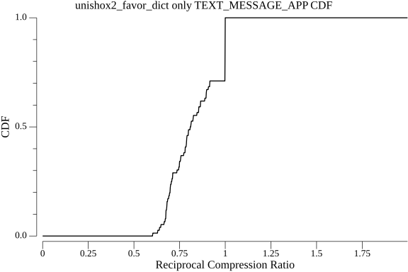

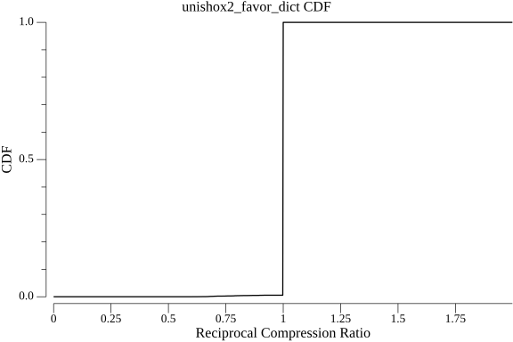

### `shoco_TextEn_tmthrgd_Jorropo`

### `unishox2_favor_sym`

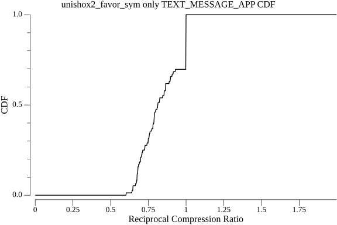

### `unishox2_favor_umlaut`

### `unishox2_no_dict`

### `smaz_cespare_Jorropo`

### `shoco_WordsEn_tmthrgd_Jorropo`

### `shoco_FilePath_tmthrgd_Jorropo`

### `shoco_Emails_tmthrgd_Jorropo`

### `noop`

### `meshtasticmodel_V2_EgonElbre`

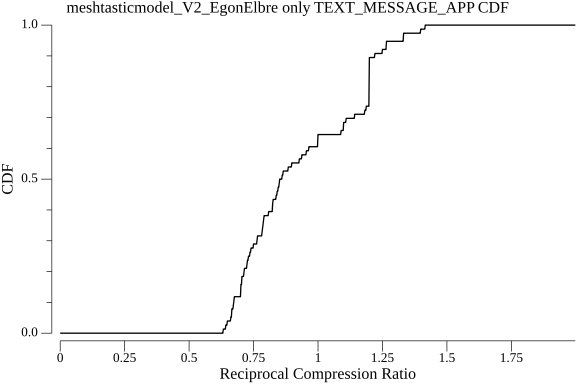

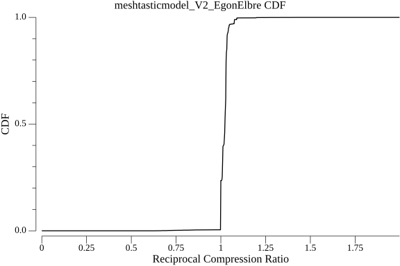

### `lz4_cloudflareHC`

### `lz4_cloudflare`

### `flate_klauspost`

### `rle_inkyblackness`

### `flate_std`

### `lzw_std`

### `shoco_TextEn_tmthrgd`

### `shoco_WordsEn_tmthrgd`

### `shoco_Emails_tmthrgd`

### `shoco_FilePath_tmthrgd`

### `zlib_klauspost`

### `smaz_cespare`

### `zlib_std`

### `lz4_pierrec`

### `s2_klauspost`

### `snappy_klauspost`

### `gzip_klauspost`

### `gzip_std`

