# Meshtastic Compression Showdown

This project contain benchmarks of various compression algorithms applied on a data of meshtastic packets.

For context a Reciprocal Compression Ratio **above** 1 means the compressed data is **bigger** than the uncompressed data.
One **bellow** 1 means the compressed data is **smaller** than the uncompressed data.

## Results

| Compressor | Average Reciprocal Compression Ratio (TEXT_MESSAGE_APP only) |
|------------|--------------------------------------------------------------|
| `shoco_TextEn_tmthrgd_Jorropo` | 0.7711 |
| `unishox2_meshtastic` | 0.7892 |
| `smaz_cespare_Jorropo` | 0.8253 |
| `snowflake_Jorropo` | 0.8253 |
| `shoco_TextEn_tmthrgd` | 0.8434 |
| `shoco_WordsEn_tmthrgd_Jorropo` | 0.8614 |
| `shoco_FilePath_tmthrgd_Jorropo` | 0.8675 |
| `smaz_cespare` | 0.9036 |
| `shoco_Emails_tmthrgd_Jorropo` | 0.9096 |
| `shoco_WordsEn_tmthrgd` | 0.9337 |
| `shoco_FilePath_tmthrgd` | 0.9398 |
| `shoco_Emails_tmthrgd` | 0.9819 |
| `noop` | 1.0000 |
| `zstd_klauspost_chopped_Jorropo` | 1.0361 |
| `lz4_cloudflare` | 1.0602 |
| `lz4_cloudflareHC` | 1.0602 |
| `flate_klauspost` | 1.1145 |
| `rle_inkyblackness` | 1.1325 |
| `lzw_std` | 1.1627 |
| `flate_std` | 1.2289 |
| `zstd_klauspost` | 1.3253 |
| `zlib_klauspost` | 1.3313 |
| `zlib_std` | 1.4458 |
| `lz4_pierrec` | 1.5422 |
| `s2_klauspost` | 1.6506 |
| `snappy_klauspost` | 1.6506 |
| `gzip_klauspost` | 1.7651 |
| `gzip_std` | 1.8795 |

| Compressor | Average Reciprocal Compression Ratio |
|------------|--------------------------------------|
| `shoco_TextEn_tmthrgd_Jorropo` | 0.9991 |
| `unishox2_meshtastic` | 0.9992 |
| `smaz_cespare_Jorropo` | 0.9993 |
| `snowflake_Jorropo` | 0.9993 |
| `shoco_WordsEn_tmthrgd_Jorropo` | 0.9995 |
| `shoco_FilePath_tmthrgd_Jorropo` | 0.9995 |
| `shoco_Emails_tmthrgd_Jorropo` | 0.9997 |
| `noop` | 1.0000 |
| `zstd_klauspost_chopped_Jorropo` | 1.0181 |
| `lz4_cloudflareHC` | 1.0330 |
| `lz4_cloudflare` | 1.0335 |
| `flate_klauspost` | 1.0650 |
| `rle_inkyblackness` | 1.0843 |
| `flate_std` | 1.1276 |
| `lzw_std` | 1.1452 |
| `shoco_TextEn_tmthrgd` | 1.1714 |
| `shoco_WordsEn_tmthrgd` | 1.1723 |
| `shoco_Emails_tmthrgd` | 1.1736 |
| `shoco_FilePath_tmthrgd` | 1.1749 |
| `zstd_klauspost` | 1.1835 |
| `zlib_klauspost` | 1.1901 |
| `zlib_std` | 1.2527 |
| `smaz_cespare` | 1.2528 |
| `lz4_pierrec` | 1.3095 |
| `s2_klauspost` | 1.3710 |
| `snappy_klauspost` | 1.3743 |
| `gzip_klauspost` | 1.4404 |
| `gzip_std` | 1.5030 |

## CDF Graphs

The following graphs show the cumulative distribution function (CDF) of the reciprocal compression ratios for each compressor.

### `shoco_TextEn_tmthrgd_Jorropo`

### `unishox2_meshtastic`

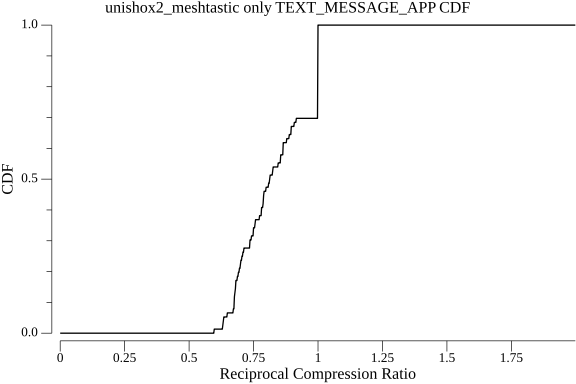

### `smaz_cespare_Jorropo`

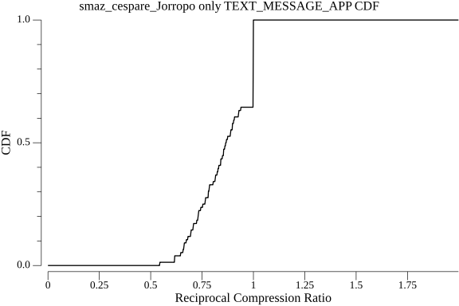

### `snowflake_Jorropo`

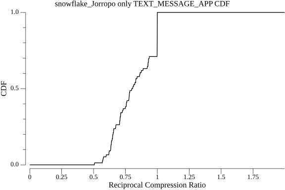

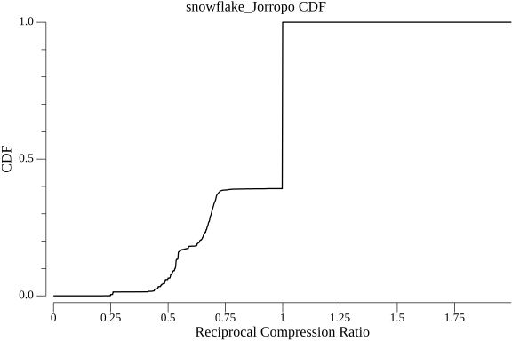

### `shoco_WordsEn_tmthrgd_Jorropo`

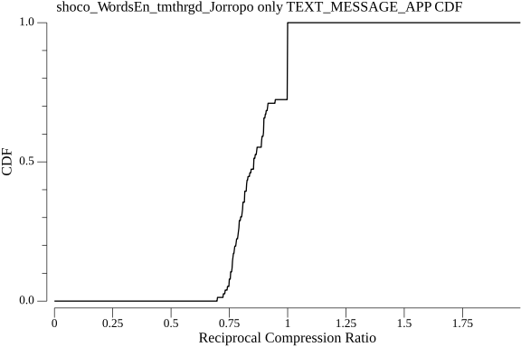

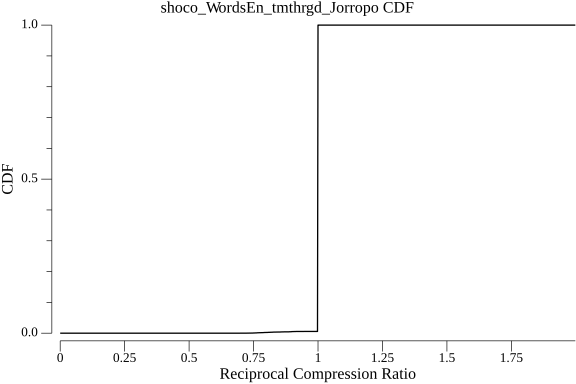

### `shoco_FilePath_tmthrgd_Jorropo`

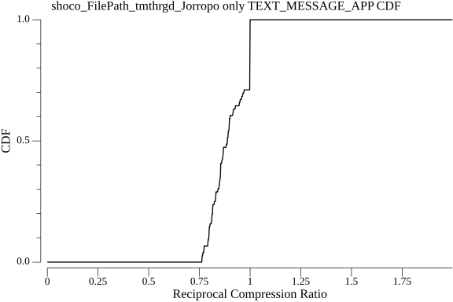

### `shoco_Emails_tmthrgd_Jorropo`

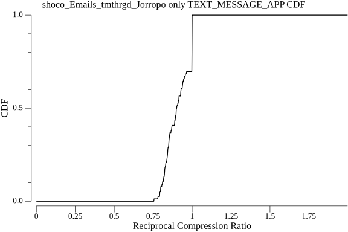

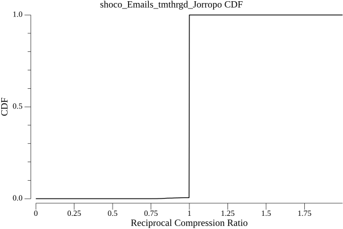

### `noop`

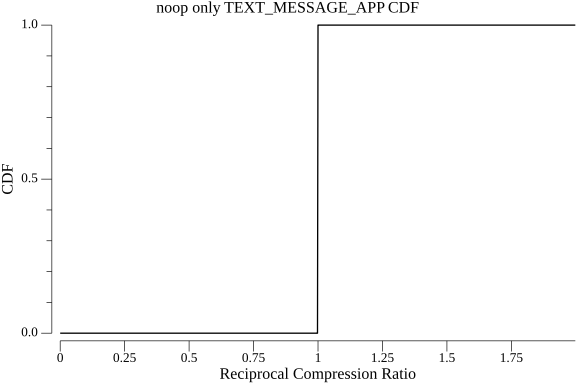

### `zstd_klauspost_chopped_Jorropo`

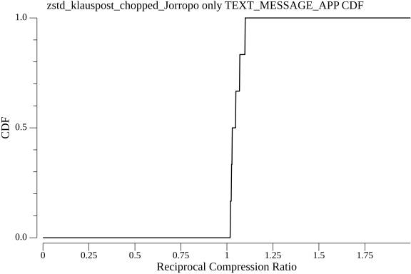

### `lz4_cloudflareHC`

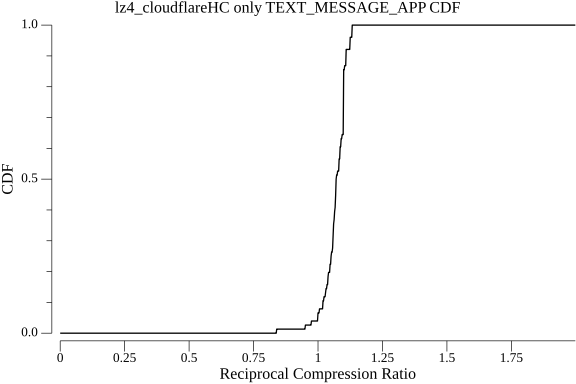

### `lz4_cloudflare`

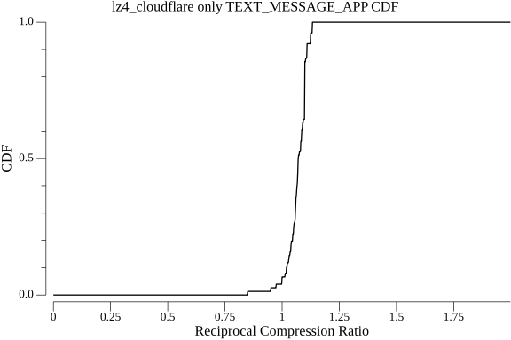

### `flate_klauspost`

### `rle_inkyblackness`

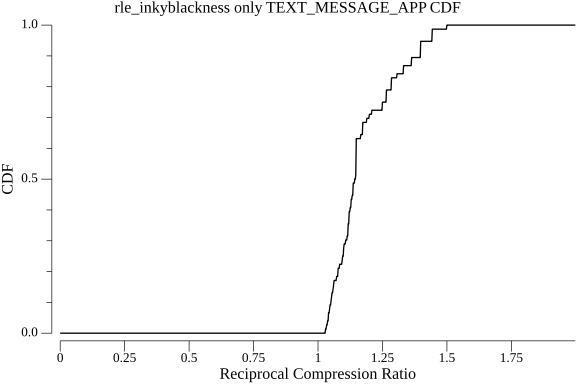

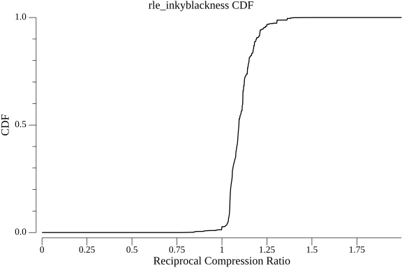

### `flate_std`

### `lzw_std`

### `shoco_TextEn_tmthrgd`

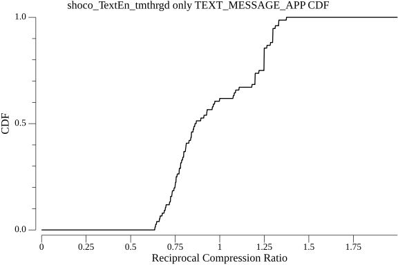

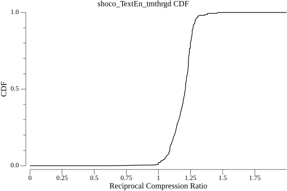

### `shoco_WordsEn_tmthrgd`

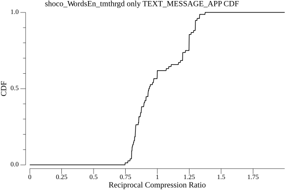

### `shoco_Emails_tmthrgd`

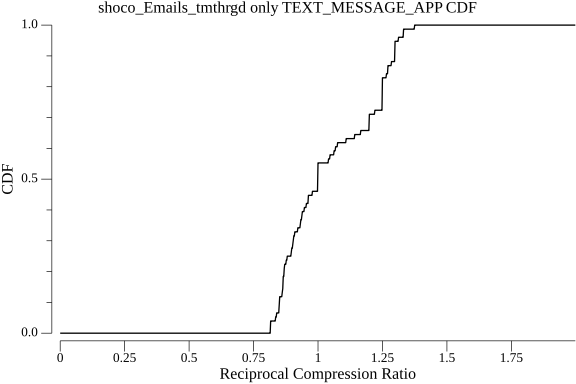

### `shoco_FilePath_tmthrgd`

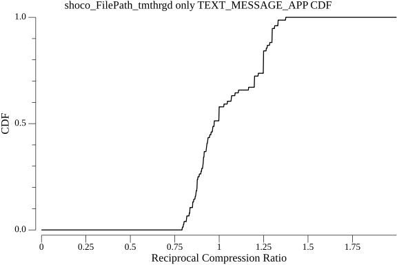

### `zstd_klauspost`

### `zlib_klauspost`

### `zlib_std`

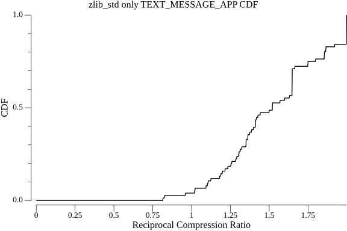

### `smaz_cespare`

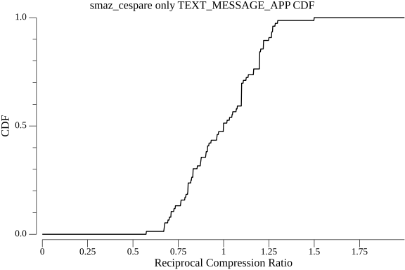

### `lz4_pierrec`

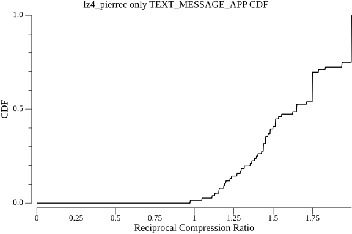

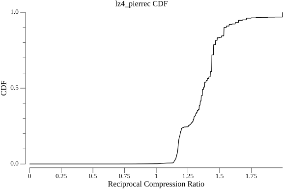

### `s2_klauspost`

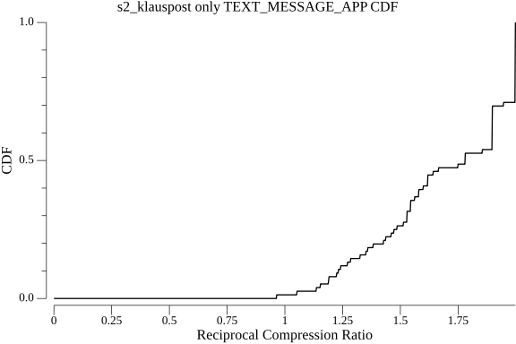

### `snappy_klauspost`

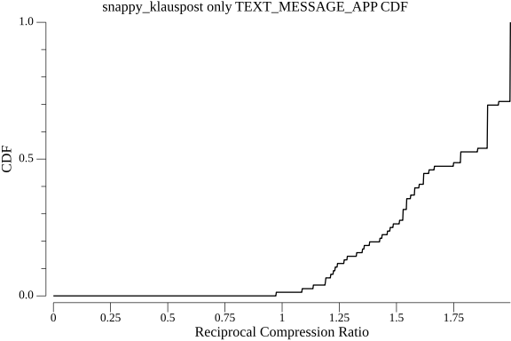

### `gzip_klauspost`

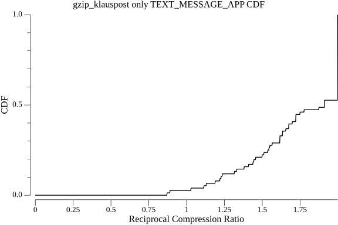

### `gzip_std`

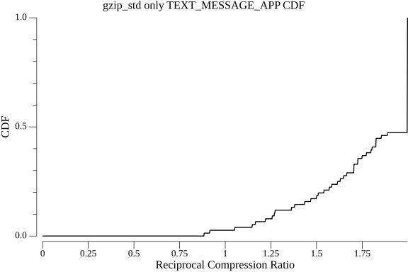

